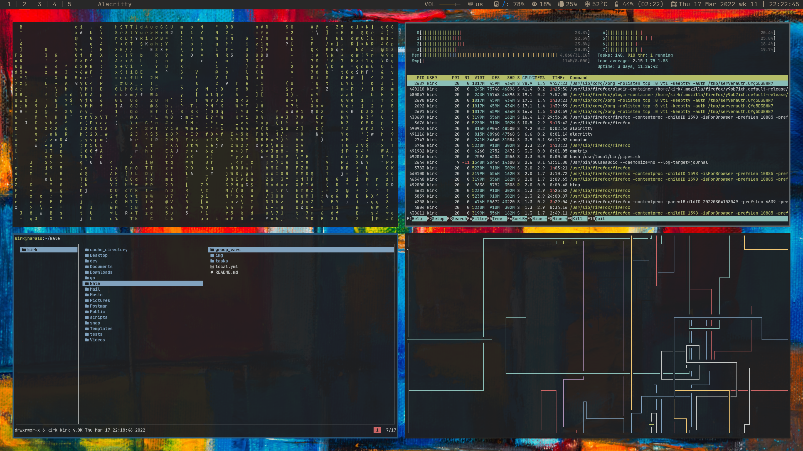

<div id="top"></div>

<!-- PROJECT LOGO -->
<br />
<div align="center">
  <a href="https://github.com/kirkeasterson/kale">
    
  </a>

<h3 align="center">Kirk's Automated Linux Environment (KALE)</h3>

  <p align="center">
    An ansible playbook designed to automate install of my (Kirk's) linux environment in Ubuntu.
  </p>
</div>

<!-- TABLE OF CONTENTS -->
<details>
  <summary>Table of Contents</summary>
  <ol>
    <li><a href="#about-the-project">About The Project</a></li>
    <li>
      <a href="#getting-started">Getting Started</a>
      <ul>
        <li><a href="#prerequisites">Prerequisites</a></li>
        <li><a href="#installation">Installation</a></li>
      </ul>
    </li>
    <li><a href="#usage">Usage</a></li>
    <li><a href="#roadmap">Roadmap</a></li>
    <li><a href="#contact">Contact</a></li>
  </ol>
</details>

## About The Project

This repository originally a series of bash scripts to be used on an installation of Ubuntu server 21.10.
But the scripts were fragile and had to be manually tested to ensure correctness.
Ansible is the sensible alternative to this approach, so the scripts were rewritten for Ansible.

## Getting Started

As stated above, this repository is intended to be used on an installation of Ubuntu server 21.10.
It will likely work for other versions of Ubuntu, and other Debian based distributions.
But there is no guarantee that it will work.

This repository was designed to be used with `ansible-pull`, and has not been tested with any other Ansible commands.

### Prerequisites

The only prerequisite is Ansible.

```sh
sudo apt install ansible
```

### Installation

Clone the repo, and check out the `arch-feature` branch.

Run the below commands from the base directory of the repository, and then reboot your computer.

```sh
ansible-galaxy install -r requirements.yml
ansible-playbook arch.yml --ask-become-pass
```

## Usage

There are future plans to add a detailed guide on how to use the environment post-installation.
The only advice I have now is to read the configs and figure it out yourself.

## Roadmap

- [ ] Add more detailed usage
- [ ] Add support for other ansible commands

## Contact

Your Name - kirk.easterson@gmail.com

Project Link: [https://github.com/kirkeasterson/kale](https://github.com/kirkeasterson/kale)
